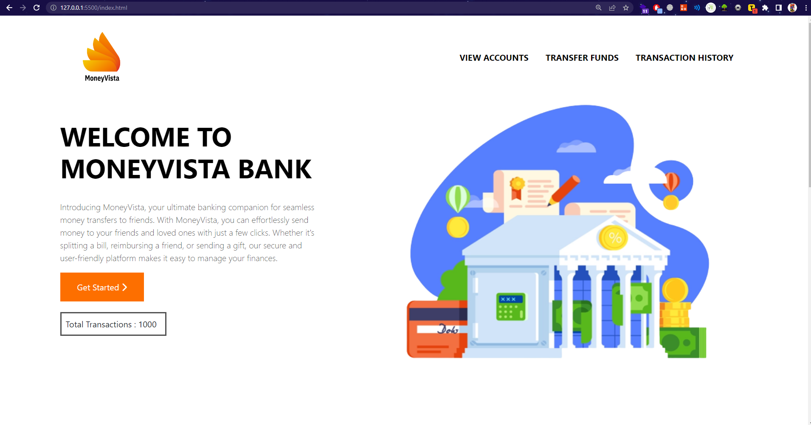
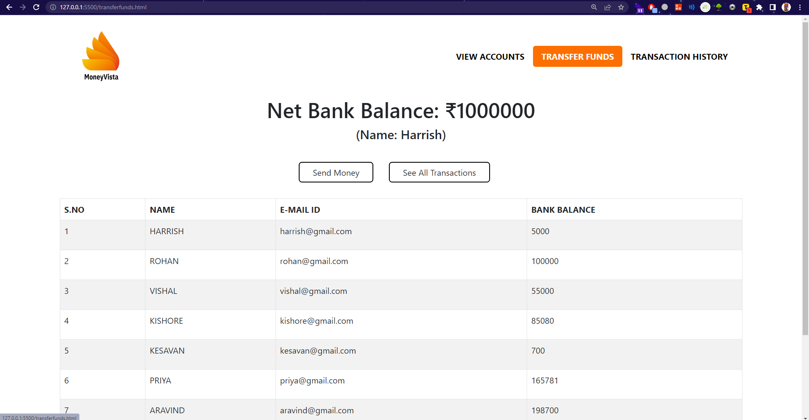

# MoneyVista
- A Banking Website
# The Sparks Foundation
This is a project developed as a part of internship in The Sparks Foundation
# About MoneyVista
A Website used to transfer money between multiple users (Project contains 10 dummy users).

MoneyVista, your go-to online banking system. Our platform is designed to simplify the process of sending money to your friends quickly

Flow of the Website: Home Page > View all Users > Select and View one User > Transfer Money > Select reciever > View all Users > View Transfer History.

Note: Website is not responsive yet

live url: https://harrishdev.github.io/MoneyVista/

YouTube url: https://youtu.be/iqTV0HCDr8I

Linkedin: url: https://tinyurl.com/2xdbavfb

